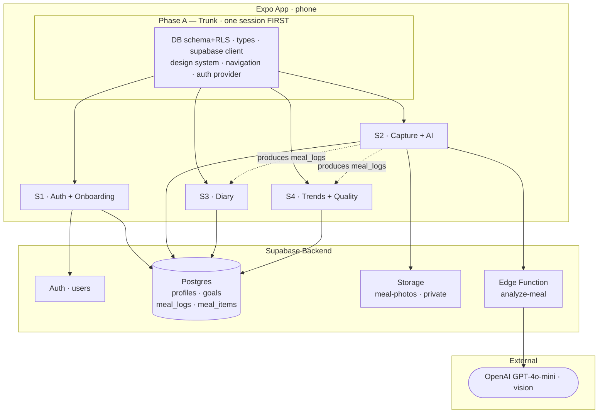
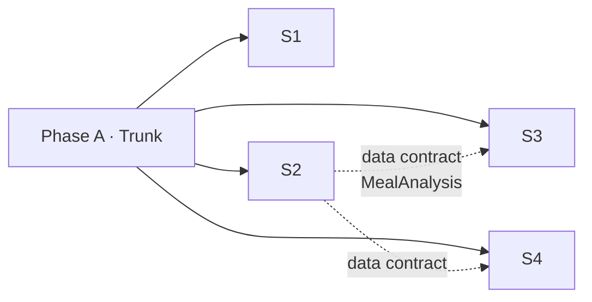

# Architecture & Session Map

A bird's-eye view of the app's parts and how they map to parallel Claude
sessions. Pairs with [MODULES.md](MODULES.md) (rules) and [WORKFLOW.md](WORKFLOW.md).

## System diagram

## Session dependency / order

Phase A must finish and merge before any of S1–S4 begin. Once it's on `main`,
S1–S4 run in parallel; S3/S4 can build against mock `MealAnalysis` data and
integrate with S2's real output last.

## The sessions

### Phase A — Trunk (one session, first) — _in progress_
The foundation every module depends on. Owns the shared, stable code so feature
sessions never need to touch it.

| Owns | Deliverables |
|---|---|
| `supabase/migrations/` | schema + RLS (plan `0001`) |
| `src/types/` | `MealAnalysis` contract (exists) + generated DB types |
| `src/lib/` | supabase client (exists) + **auth provider & `useUser` hook** |
| `src/shared/ui/` | design system: theme + Button/Card/Input/Screen |
| `src/app/` | navigation skeleton (tabs + auth gate) |

### S1 — Auth & Onboarding (+ Profile/Settings)
| Owns | Scope | Starts when |
|---|---|---|
| `src/features/auth/` | login, signup, password reset, onboarding wizard (set goals / TDEE), profile & settings screens | Phase A merged |
| Tables | `profiles`, `goals` | |

### S2 — Capture & AI Analysis _(the core / highest risk)_
| Owns | Scope | Starts when |
|---|---|---|
| `src/features/capture/` + `supabase/functions/analyze-meal/` | camera/upload → Storage upload → `analyze-meal` Edge Function (OpenAI) → **editable results** → save meal. Includes the accuracy eval. | Phase A merged |
| Tables / infra | `meal_logs`, `meal_items`, Storage, `MealAnalysis` | |

### S3 — Diary & Tracking
| Owns | Scope | Starts when |
|---|---|---|
| `src/features/diary/` | daily diary list, running totals vs. goals, edit/delete logs | Phase A merged (mock data ok) |
| Tables | `meal_logs`, `meal_items` (read) | |

### S4 — Trends & Quality Score
| Owns | Scope | Starts when |
|---|---|---|
| `src/features/trends/` | charts over time, streaks, food-quality-score trend | Phase A merged (mock data ok) |
| Tables | `meal_logs` (read) | |

## Why this split works
- **No shared-file collisions:** each session owns one `features/<name>/` folder;
  `types/`, `lib/`, `shared/ui/` are frozen in Phase A.
- **Auth overlap avoided:** the trunk owns the auth *provider/hook* in `src/lib/`;
  S1 owns the auth *screens* in `src/features/auth/`.
- **Clear data contract:** S2 produces `meal_logs`; S3/S4 consume the frozen
  `MealAnalysis` type, so they don't block on S2.
- **Git:** during parallel work, each session uses `feat/<module>` + a small PR
  (we suspend commit-straight-to-main only while running in parallel).
